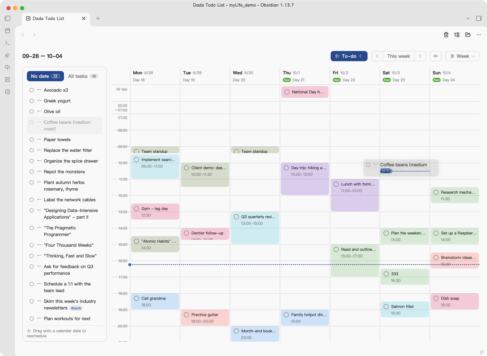
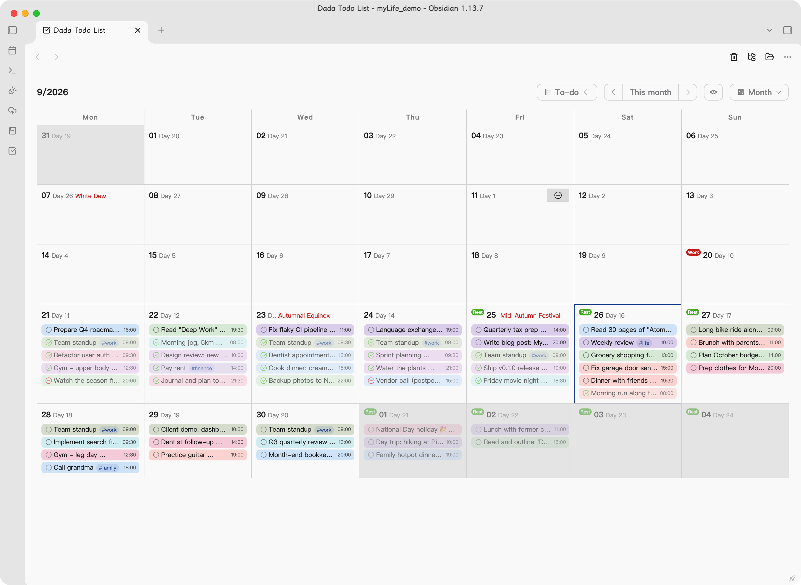
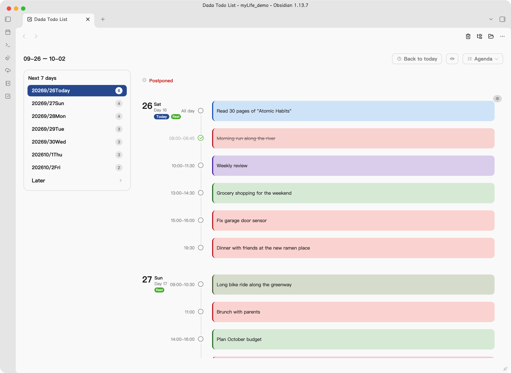
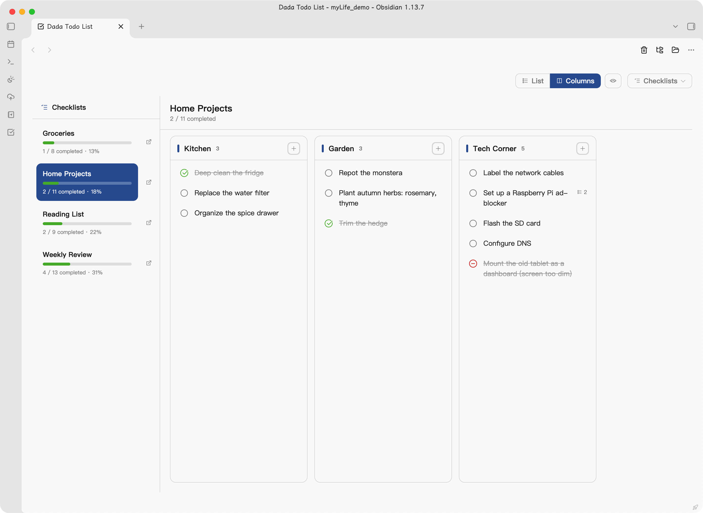
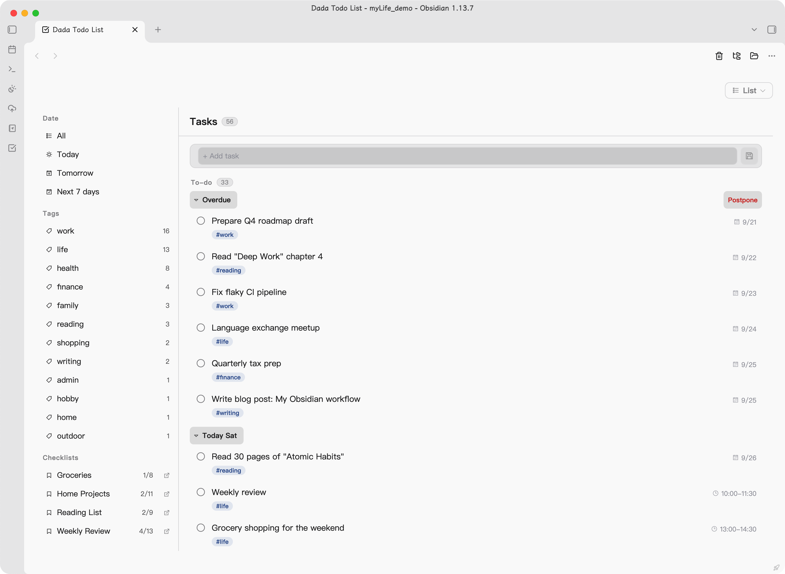
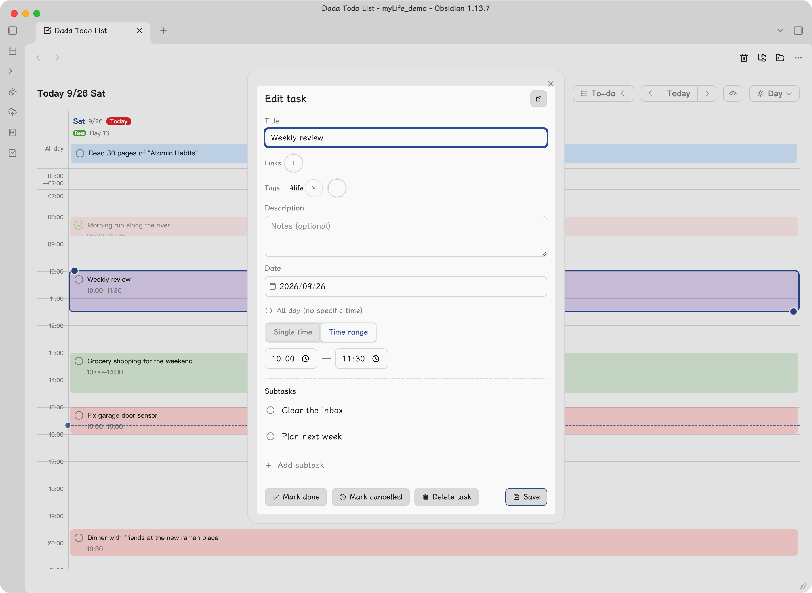

# Dada Todo List

> A task & checklist manager for [Obsidian](https://obsidian.md), built entirely on plain Markdown checkboxes.
> Your tasks live in your own notes — daily notes, an inbox note, and checklist files. No account, no cloud, no lock-in.

[English](#english) | [简体中文](#简体中文)

---

## 📸 界面预览

<p align="center">
  <br>
  <em>周视图：七天并排时间轴，定时任务按泳道排布、互不遮挡</em>
</p>

<p align="center">
  <br>
  <em>月视图：农历、节气、节日、法定节假日（休 / 班）一目了然</em>
</p>

<p align="center">
  <br>
  <em>日程：按日期纵向滚动的议程，过期待办置顶</em>
</p>

<p align="center">
  <br>
  <em>清单：按标题分组管理，列表 / 分栏两种布局</em>
</p>

<p align="center">
  <br>
  <em>列表：全部任务池，按标签 / 日期 / 清单 / 状态多维筛选</em>
</p>

<p align="center">
  <br>
  <em>任务编辑：标题内联语法、时间形态切换、子任务管理</em>
</p>

---

## English

**Dada Todo List** turns your Obsidian vault into a full-featured task and checklist manager — powered entirely by plain Markdown checkboxes (`- [ ]` / `- [x]`). No accounts, no cloud services, no proprietary database: your tasks are simply lines in your own notes, and the plugin brings them together with calendar, timeline and agenda views plus a polished editing experience.

### Who is it for?

- **Already managing tasks in Obsidian?** If your to-dos are scattered across daily notes and scattered checklists — and finding them means searching — this plugin is for you. It gathers everything you've already written into six views (day / week / month / agenda / checklists / list) with zero migration: your notes stay exactly where they are.
- **Haven't tried task management in Obsidian yet?** You don't need yet another to-do service. Your vault *is* your task manager: plain Markdown that stays readable forever, stored locally, synced with whatever you already use. Start with a single `- [ ]` and grow your own system from there.

### Highlights

- **Six views** — day timeline, seven-day week timeline with lane layout, month calendar (with Chinese lunar dates, solar terms, festivals and statutory holidays), rolling agenda, grouped checklists, and a filterable list of everything
- **Inline syntax** — write `#tags` and `[links](url)` right in the task title; they render as clickable pills and hyperlinks
- **Flexible time** — single time, time ranges (start – end), or all-day, switchable per task
- **Subtasks** — indented lines become nested subtasks of any depth
- **Drag to reschedule** — drag tasks between days, or drag the handles on the timeline to fine-tune start / end times
- **Smart extras** — overdue postponement in one click, `Ctrl/⌘+click` to jump to the source note, per-task reminder mute with 🔕
- **Live sync** — edits made directly in the editor (or from another device) refresh the panel automatically

### Installation

**Manual**: download `main.js`, `styles.css` and `manifest.json` into
`your-vault/.obsidian/plugins/obsidian-dada-todo-list/`, then enable the plugin in Settings → Community plugins.

**BRAT**: install [BRAT](https://github.com/TfTHacker/obsidian42-brat) and add this repository.

### Where your data lives

| Data | Location |
|---|---|
| Dated tasks | Your **core Daily notes** folder (follows its folder & date format) — tasks are checkboxes inside each daily note |
| Dateless tasks (inbox) | `DadaTodoList.md` in the vault root by default; configurable, created automatically |
| Checklists | Any note whose frontmatter `tags` include `todoList` (configurable), anywhere in the vault |

Everything is plain Markdown. Uninstalling the plugin changes nothing — your notes stay as they are.

### Settings

| Option | Description |
|---|---|
| Open location | Left sidebar / main workspace tab / right sidebar |
| Open on startup | Automatically open the panel when Obsidian launches |
| Inbox file | Where dateless tasks are stored; changing it offers to migrate existing tasks |
| Checklist tags | Frontmatter tags that mark a note as a checklist file |
| Daily-notes load window | Load only the last N days of daily notes (30 / 90 / 180 / 365 / all; default all) — lower it on large vaults for better performance |

### Language

The interface follows Obsidian's language setting (English / 简体中文). Restart Obsidian after switching.

> 完整的中文文档见下方 [简体中文](#简体中文) 章节。

---

## 简体中文

**Dada Todo List（达达清单）** 是一款基于 Obsidian 笔记的待办与清单管理插件。所有任务就是你笔记里的 Markdown 复选框（`- [ ]` / `- [x]`），插件负责把它们聚合起来，提供日历、时间轴、日程等多种视图和顺手的编辑体验。

### 🎯 这个插件适合你吗？

- 🙋 **你已经在用 Obsidian 管理待办** —— 任务散落在日记和各处笔记里，找起来靠搜索、看起来只有干巴巴的列表？装上它，你写过的每一行待办都会聚合成日历、时间轴、日程和清单，**数据一行都不用搬**，还在你原来的笔记里。
- 🌱 **你还没试过用 Obsidian 管理待办** —— 不必再注册第 N 个待办服务：你的库就是任务管理器，纯 Markdown 复选框、全本地、跟着笔记永久保存。从一行 `- [ ]` 开始，慢慢长出属于自己的任务系统。

### 💡 快速上手

1. 开启核心插件「**日记**」（设置 → 核心插件）——有日期的任务就存在你的每日笔记里；
2. 点击左侧栏的 ✅ 图标（或命令面板「打开 Dada Todo List」）打开面板；
3. 在任意一篇每日笔记里写下一行 `- [ ] 买牛奶 #生活`，面板里立刻就能看到。

### ✨ 功能特性

#### 🗓 六种视图，随意切换

| 视图 | 适合场景 |
|---|---|
| **日视图** | 聚焦一天：时间轴 + 凌晨列表 + 全天任务 |
| **周视图** | 一周七天并排时间轴，定时任务按泳道排布、互不遮挡 |
| **月视图** | 整月日历格：农历、节气、节日、法定节假日（休/班）一目了然 |
| **日程** | 按日期纵向滚动的议程：已延期 → 未来 7 天 → 更远 |
| **清单** | 按 `###` 标题分组管理清单文件，支持列表 / 分栏两种布局 |
| **列表** | 全部任务池：按标签、日期、清单、状态（已完成 / 已取消）多维筛选 |

#### ✏️ 顺手的任务编辑

- **标题内联语法**：直接写 `#标签` 和 `[文字](链接)`，渲染为可点击的标签胶囊与超链接
- **时间灵活**：单时间、时间段（开始 – 结束）、全天，三种形态一键切换
- **子任务**：无限层级缩进即子任务，弹窗内直接增删改
- **到点提醒**：标题里写 🔕 可关闭该任务到点提醒

#### 🖱 效率操作

- **拖拽改期**：周 / 月视图之间拖拽任务即可改期；时间轴上还能拖动手柄精细调整开始 / 结束时间
- **过期待办顺延**：一键把所有已过期任务顺延到今天（保留原时刻，全天任务保持全天）
- **Ctrl/⌘ + 点击**：直接跳转到任务所在的笔记并高亮定位
- **待办侧栏**：周 / 月视图左侧可展开「无日期 / 所有待办」列表，拖到日历即改期
- **实时同步**：在编辑器里直接改笔记、或其他设备同步变更后，面板自动刷新（防抖，无闪烁）

#### 🔒 数据与隐私

- **纯 Markdown**：任务就是笔记里的复选框，插件删除后数据原样保留
- **全本地**：不依赖任何外部服务，不联网，天然适配各种同步方案
- **界面记忆**：视图、筛选等偏好存本机 localStorage，不污染 data.json、不触发云盘同步

#### 🌍 界面

- **中英双语**：跟随 Obsidian 界面语言自动切换
- **农历支持**：月视图 / 周视图表头显示农历、节气与节日，英文界面下同样可用
- **主题跟随**：配色全部走 Obsidian 原生变量，深浅色主题、自定义主题色都自动适配

### 🚀 安装

**手动安装**：下载 `main.js`、`styles.css`、`manifest.json` 三个文件，放入
`你的库/.obsidian/plugins/obsidian-dada-todo-list/` 目录，然后在设置中启用第三方插件并开启本插件。

**BRAT**：安装 [BRAT](https://github.com/TfTHacker/obsidian42-brat) 后，添加本仓库地址即可自动更新。

### 📁 数据存储

| 数据 | 位置 |
|---|---|
| 有日期的任务 | **核心「日记」插件**配置的日记文件夹（文件夹与文件名格式都跟随日记设置），任务即每日笔记正文中的复选框 |
| 无日期的任务（收件箱） | 默认库根目录 `DadaTodoList.md`，可在设置中改为任意文件；不存在时启动自动创建 |
| 清单 | frontmatter `tags` 中包含 `todoList`（可改）的笔记，**全库识别**，不限目录 |

> 三个位置只有收件箱路径与清单标记是本插件的设置项；每日笔记完全跟随你现有的日记配置，装上即用、无需导入。
>
> 若核心「日记」插件未开启，面板顶部会出现提醒条，有日期任务暂不可读写，收件箱与清单不受影响。

### ⚙️ 设置

| 设置项 | 说明 |
|---|---|
| **打开位置** | 左侧栏 / 主工作区标签页 / 右侧栏 |
| **启动后自动打开** | 每次启动 Obsidian 自动打开任务面板 |
| **收件箱文件** | 无日期任务的存放文件（相对库根目录的路径）；更换路径时若旧文件还有任务，会主动询问是否整体迁移 |
| **清单识别标记** | frontmatter `tags` 含任一标记的笔记即清单文件，可配置多个 |
| **每日笔记加载范围** | 仅加载最近 N 天的每日笔记（近 30 / 90 / 180 天 / 一年 / 全部，默认全部）。笔记与任务较多时可调小以提升加载性能 |

### 🌐 语言

界面跟随 Obsidian 的语言设置（简体中文 / English）。切换 Obsidian 语言后重启即可生效。

---

## 💖 赞赏支持

如果这个插件对你有帮助，欢迎请作者喝杯咖啡，是我持续更新的动力～

微信赞赏 WeChat Pay


---

## 🛠 开发

```bash
npm install
npm run build     # 生产构建（产物：obsidian-dada-todo-list/main.js、styles.css、manifest.json）
npm run dev       # 开发模式：监听 src/ 改动自动重建
```

本地调试：把测试库的插件目录软链到产物目录即可（目录名与插件 id 一致）：

```bash
ln -s "$(pwd)/obsidian-dada-todo-list" "你的库/.obsidian/plugins/obsidian-dada-todo-list"
```

## 📄 License

MIT
